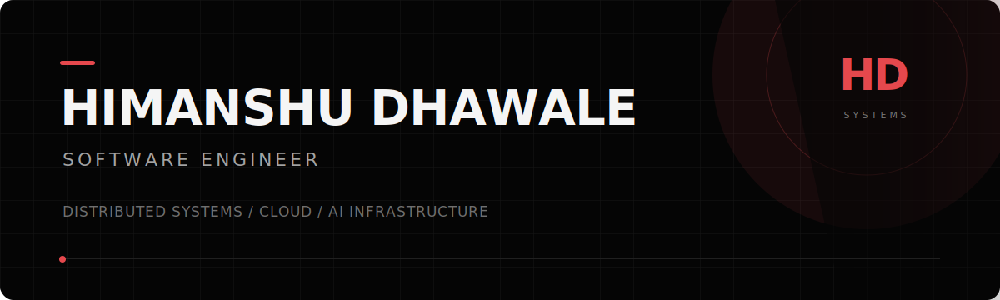

<!-- GitHub profile README -->

<p align="center">
  
</p>

<p align="center">
  <strong>Software Engineer at Microsoft</strong><br />
  Distributed systems · Cloud infrastructure · AI developer tooling
</p>

<p align="center">
  <a href="https://github.com/himanshudhawale">
    
  </a>
  
</p>

## 私について · About

I build dependable backend and platform systems, with a focus on distributed
systems, cloud infrastructure, and practical AI tooling. I enjoy working from
first principles: defining the invariants, measuring the tradeoffs, and making
the system observable.

```text
現在 / now       building reliable systems and developer tools
探求 / exploring consensus, caching, real-time state, and AI infrastructure
原則 / principle correctness first; complexity only when it earns its place
```

## 技術 · Technology

<p>
  
</p>

## 作品 · Selected work

| Project | What it explores | Stack |
| --- | --- | --- |
| **[Cistern](https://github.com/himanshudhawale/cistern)** | Semantic caching for LLM calls, with measurable cost savings and correctness benchmarks | Python |
| **[Yakusoku Ledger](https://github.com/himanshudhawale/yakusoku-ledger)** | Privacy-aware student–university agreements on a permissioned blockchain | Hyperledger Fabric, Go, Node.js |
| **[Bullfight](https://github.com/himanshudhawale/bullfight)** | Server-authoritative real-time gameplay with reconnect-safe state synchronization | TypeScript, Socket.IO, Cosmos DB, Azure |
| **[tokenslim](https://github.com/himanshudhawale/tokenslim)** | Offline token measurement, context slimming, CI budget guards, and MCP integration | Python, MCP |

## 統計 · GitHub

<p align="center">
  
  
</p>

<p align="center">
  
</p>

<p align="center">
  <sub>継続は力なり · Consistency becomes strength.</sub>
</p>
